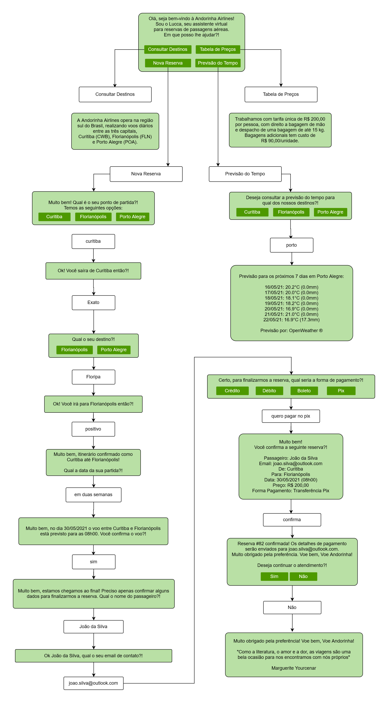
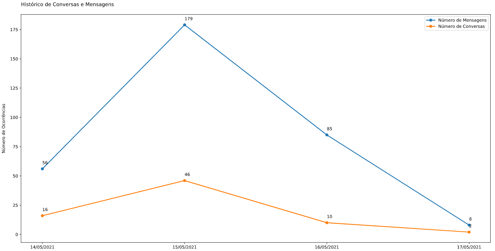
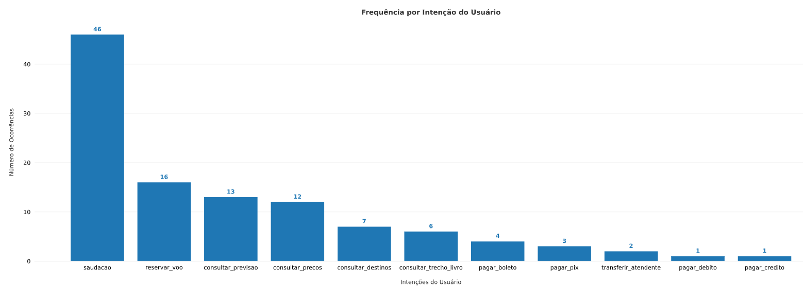
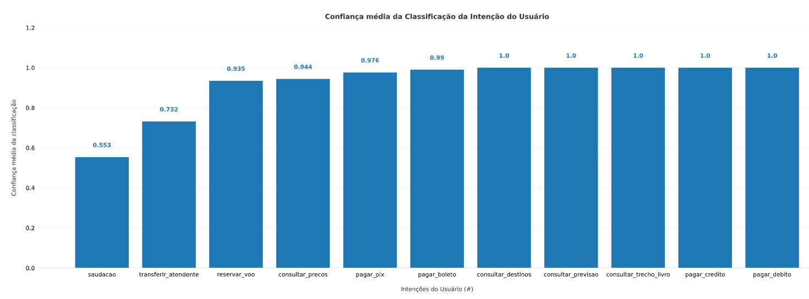

# Chatbot (IBM Watson) para Reserva de Passagens Aéreas

**Autor: Marcus Moresco Boeno**

**Último Update: 2021-05-16**

Assistente Virtual (Chatbot IBM Watson) apresentado para a disciplina de Chatbots da Pós-Graduação em Data Science (Turma 2) da Universidade Regional de Blumenau.

O Chatbot desenvolvido consiste em um protótipo de assistante virtual de uma companhia aérea fictícia, a _Andorinha Airlines_. O chatbot, nomeado como _Lucca_, é baseado em funcionalidades da IBM Cloud (Watson e Cloud Functions) e tem domínio fechado. Seu intuito é auxiliar usuários na reserva de voos entre os destinos operados pela companhia. Devido a natureza didática do projeto os destinos são limitados as capitais da região sul do Brasil (Curtiba, Florianópolis e Porto Alegre).

Por meio de [WebHooks](https://cloud.ibm.com/docs/assistant?topic=assistant-dialog-webhooks) e [Cloud Functions](https://cloud.ibm.com/functions/) da IBM, o chatbot ainda indica a previsão do tempo para os próximos 7 dias nos destinos disponíveis utilizando requisições para a [OpenWeather API](https://openweathermap.org/api). Ao final do atendimento o chatbot apresenta uma citação envolvendo o tema de viagem, também por meio de um webhook.

De forma a facilitar a interação com o assistente foi construida uma interface gráfica web, com front-end básico (HTML5, CSS3 e JavaScript) e back-end baseado no framework Django (Python).

O chatbot está disponível na forma de um widget no canto inferior direito da página https://andorinha-airlines.herokuapp.com

Alguns arquivos descrevendo o desenvolvimento do chatbot podem ser encontrados em:
 - Arquivo JSON com fonte (Skill) do Chatbot: ['docs/skill-airline-reservation.json'](docs/skill-airline-reservation.json)
 - Código fonte do webhook (Cloud Function) utilizado: ['docs/webhook_api_calls.py'](docs/webhook_api_calls.py)
 - Fluxo do diálogo base do chatbot: ['docs/fluxo_dialogo_chatbot_airline.pdf'](docs/fluxo_dialogo_chatbot_airline.pdf)
 - Jupyter Notebook com extração e apresentação de métricas: ['docs/metricas_watson_assistant.ipynb'](docs/metricas_watson_assistant.ipynb)

A seguir estão apresentadas as tecnologias utilizadas para construção do projeto, assim como o fluxo base de diálogo do chatbot e algumas métricas explorando logs coletados pelo watson após alguns dias de interações simuladas.

# Índice

1. [Tecnologias Utilizadas](#tecnologias-utilizadas)
2. [Deploy no Heroku](#deploy-no-heroku)
3. [Fluxo de Diálogo](#fluxo-de-diálogo)
4. [Métricas](#métricas)
4. [Conclusão](#conclusão)

# Tecnologias Utilizadas
[Voltar ao topo](#índice)

O projeto conta com três componentes principais, sendo o desenvolvimento do chatbot, do aplicativo web e de funcionalidades para extração de métricas de utlização do bot.
As tecnologias utilizadas durante o desenvolvimento foram:

Chatbot:
 - Core: [IBM Watson Assistant](https://www.ibm.com/cloud/watson-assistant)
 - Webhooks: [IBM Cloud Functions](https://cloud.ibm.com/functions/) (Python)
 - Previsão do Tempo: [OpenWeather API](https://openweathermap.org/api)

Aplicativo Web:
 - Back-end: [Django](https://www.djangoproject.com/)
 - Front-end: HTML5, CSS3 e JavaScript
 - Plataforma: [Heroku](https://www.heroku.com/)

Extração do Métricas:
 - Python ([numpy](https://numpy.org/), [pandas](https://pandas.pydata.org/), [matplotlib](https://matplotlib.org/))
 - [Jupyter Notebook](https://jupyter.org/)
 - [IBM Watson Assistant API v1](https://cloud.ibm.com/apidocs/assistant/assistant-v1) 

# Deploy no Heroku
[Voltar ao topo](#índice)

De forma a facilitar a interação com o chatbot foi construida uma interface gráfica web, com front-end básico (HTML5, CSS3 e JavaScript) e back-end baseado no framework Django (Python).

O sistema foi então implementado, na forma de um aplicativo web, na plataforma [Heroku](https://www.heroku.com/). Dessa forma o chatbot fica acessível a qualquer pessoa por meio de um navegador. A plataforma Heroku foi utilizada devido a facilidade de implementação e possibilidade do uso de um plano "free-tier". 

O aplicativo web está disponível na página https://andorinha-airlines.herokuapp.com

A interface simula o site da empresa fictícia _Andorinha Airlines_, apresentando alguns elementos gráficos comuns a plataformas do ramo. A janela de conversa com o chatbot pode ser acessada através do widget presente no canto inferior direito da página.

# Fluxo de Diálogo
[Voltar ao topo](#índice)

A figura abaixo apresenta o fluxo de diálogo base para o chatbot desenvolvido.  

# Métricas
[Voltar ao topo](#índice)

A extração de logs das sessões (conversas) do assistente virtual é um fator essencial para a curadoria e manutenção do bom funcionamento de um chatbot. Para tanto a IBM permite a extração dessas informações por meio de uma [API Python]().

O arquivo Jupyter Notebook ['docs/metricas_watson_assistant.ipynb']() exemplifica a extração dos logs por meio da API e a construção das seguintes métricas:

 - Número total de conversas
 - Número total de conversas por dia
 - Número total de mensagens
 - Número total de mensagens por dia
 - Frequência das intenções dos usuários captadas pelo assistente
 - Confiança média do assistente na classificação de cada intenção

Abaixo, algumas dessas métricas são apresentadas na forma gráfica:

### Histórico de sessões (conversas) e mensagens por dia

### Frequência das intenções dos usuários captadas pelo assistente

### Confiança média do assistente na classificação de cada intenção

# Conclusão
[Voltar ao topo](#índice)

Por meio deste projeto foi possível por em prática conceitos abordados em sala de aula, assim como ter uma melhor percepção do potencial de utilização dos assistente virtuais em diversos setores da sociedade.